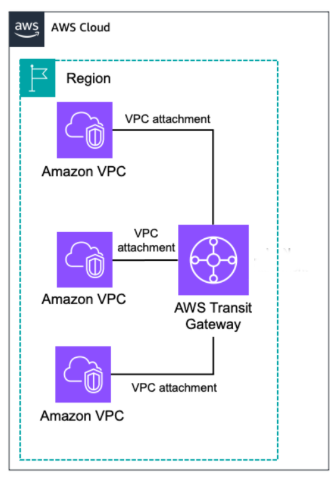

# Transit Gateway

This blueprint aims to help you deploy a Transit Gateway in an AWS organization.
AWS Transit Gateway is a service that enables you to connect your VPCs, VPNs,
and on-premises networks using a single gateway. This allows you to route traffic
between these networks and to manage the traffic flow.

## Features

- All deployment can be done from the account that hosts the Transit Gateway
- Supports multiple VPC attachment options (creating dedicated subnets or selecting
subnets by ID, type or tag)
- Can manage VPC routing to the Transit Gateway
- Manages Transit Gateway routing to VPCs and on-premises networks
- Declarative IaC configuration in a single file

## Architecture


## Modularity

This blueprint is modular in design and must be deployed in multiple steps.
The following modules are available, and their behavior depends on the
configuration provided in the `config.ts` file (see below):
- `vpc-role`: Creates a CloudFormation template for the deployment role to be used
  in the target accounts.
- `tgw`: Creates the Transit Gateway in the Transit Gateway account (hub account).
- `tgw-attachments`: Creates the Transit Gateway attachments specific
  VPCs in the target accounts (spoke accounts).
- `tgw-routing`: Creates routes in the Transit Gateway route tables.

These modules are in fact separate CDK Apps that share a common configuration.

## Prerequisites

- An existing AWS Organization with "all features enabled".
- Recommended: The organization should have a dedicated network account. The purpose of the
network account is to manage inbound and outbound communications.
Use this account to host the Transit Gateway (hub account). Please refer to the
[AWS Security Reference Architecture](https://docs.aws.amazon.com/prescriptive-guidance/latest/security-reference-architecture/network.html)
for more information.
- [Enabled resource sharing within AWS Organizations](https://docs.aws.amazon.com/ram/latest/userguide/getting-started-sharing.html#getting-started-sharing-orgs)

## Getting Started

To prepare for use, run
```
npm install
```

### Step 1 - Prepare The Hub Account

The hub account (network account) is the account where the Transit Gateway will
be hosted. This account has to be a
[regularly CDK-bootstrapped account](https://docs.aws.amazon.com/cdk/v2/guide/bootstrapping-env.html),
and all actions must be executed starting from here with credentials that enable
you to assume the CDK deployment and lookup roles. Moreover, these credentials
must also allow you to assume the respective deployment role in the target accounts
(see below).

### Step 2 - Prepare The Target Accounts (Spoke Accounts)

In order to be able to attach the Transit Gateway to a VPC, spoke accounts
must have a deployment role rolled out to them. To create a CloudFormation
template for this role, run the following command with hub account credentials:
```
npm run vpc-role
```

How you deploy this role to the specific target accounts is up to you.
You can chose from a variety of methods, such as:
- StackSets
- [Landing Zone / LZA](https://docs.aws.amazon.com/solutions/latest/landing-zone-accelerator-on-aws/solution-overview.html)
- AWS Service Catalog
- Custom automation

## Bootstrap, Configuration And Usage

The following sections will guide you through the usage and configuration of the
blueprint. All configuration is done in the `config.ts` file, which is located
in the root of the `transit-gw` directory. This file is used by all apps.

### Bootstrap

**Important**:
*make sure the config's `transitGatewayId` property is unset*. Then run:
```
npm run tgw deploy AttachmentAssets TransitGateway
```

This will create a new Transit Gateway in the hub account, and then share it
(via RAM) with all accounts provided by the configuration.
Nothing else will be deployed when you run the above statement with no
`transitGatewayId` property set. The CDK App will output the ID of the
newly created Transit Gateway. Put this ID into the `transitGatewayId`
configuration property.

### General Configuration

It is now time to take a closer look at the configuration. The `config.ts` file
holds the general configuration for the Transit Gateway deployment, as well as
the attachment and routing information for all VPCs to be connected to the
Transit Gateway.

```
type Config = {
    organizationId: string
    transitGatewayAccountId: string
    transitGatewayName: string // a unique name that will be used for the TGW Name tag
    transitGatewayId?: string

    routeTableNames: string[]
    attachmentPropagationCidrs: string[]
    attachments: Attachment[]
}
```
The first three properties should be self-explanatory, and have to be set before
you run any of the apps (see below).

The `transitGatewayId` property is the ID of the Transit Gateway that was created
during the first run. You have to put this ID here in order to attach
VPCs and create routes.

The `routeTableNames` property lists the names of the Transit Gateway
route tables to be created and managed by this blueprint.
You are going to reference these names in the `attachments` configuration.
The most simple setup would be to just have one route table in which case you
just put:
```
routeTableNames: ['default'];
```

The `attachmentPropagationCidrs` property is a list of CIDRs that will be
propagated into every VPC that is attached to the Transit Gateway.
This is a global setting and possibly includes the CIDRs of an on-premises
network. A possible setup could be:
```
attachmentPropagationCidrs: ['10.0.0.0/8', '172.16.0.0/12', '192.168.0.0/16']
```

### VPC Attachments

The `attachments` property is an array of `Attachment` objects. An `Attachment`
object looks like this:
```
interface Attachment {
    accountId: string
    vpcId: string
    createAttachmentSubnets?: AttachmentSubnetProps[]
    attachmentSubnetSelection?: ec2.SubnetSelection
    propagationSubnetSelection?: ec2.SubnetSelection[]
    tgwAssociationRouteTableName?: string
    tgwPropagationRouteTableNames?: string[]
}
```

Each `Attachment` object describes one VPC's the attachment to the Transit Gateway.
The first two properties identify the account and VPC to be connected to the
Transit Gateway.

A Transit Gateway will always have one network interface in a subnet of at least
two of the VPC's Availability Zones. It is considered AWS best practice to provide
small dedicated subnets (/28) just for the Transit Gateway attachment resource.
Setting the `createAttachmentSubnets` property lets you automatically create such
subnets during the attachment deployment. A possible setup could be:
```
createAttachmentSubnets: [
    { availabilityZone: 'eu-central-1a', cidrBlock: '10.0.0.0/28' },
    { availabilityZone: 'eu-central-1b', cidrBlock: '10.0.0.16/28' }
]
```
The attachment subnet CIDR ranges must be within the realm of one of the
VPC's assigned CIDR ranges. This is the only interference-free deployment option!

Unfortunately, it is not always possible to create dedicated subnets for the
Transit Gateway Attachment, oftentimes due to constraints of the pre-existing
setup or conflicts with on-premise network ranges. In this case, you
can use the `attachmentSubnetSelection` property instead of `createAttachmentSubnets`
to select pre-existing subnets for the Transit Gateway Attachment to place its
network interfaces in. **Important**: This option creates a hard dependency
between the selected subnets and the Transit Gateway Attachment.
Take this into consideration if you want to be able to change or delete these
subnets in the future.

`attachmentSubnetSelection`s are denoted as `ec2.SubnetSelection` objects.
One possible configuration could be:
```
attachmentSubnetSelection: {
    subnetType: ec2.SubnetType.PRIVATE | ec2.SubnetType.ISOLATED
}
```
or
```
attachmentSubnetSelection: {
    subnetGroupName: 'MyApplication'
}
```
For the latter to work in this example, the pre-existing subnets must have an
`aws-cdk:subnet-name` tag set to `MyApplication`. It is not required that the
subnets had been created by CDK.

For full control which subnets will be selected for the Transit Gateway Attachment,
you should use subnet IDs explicitly:
```
attachmentSubnetSelection: {
    byIds(['subnet-1234567890abcdef0', 'subnet-1234567890abcdef1'])
}
```

#### VPC Routing

To make use of the Transit Gateway Attachment, routes will have to be placed
in all VPC route tables associated to subnets that should be able to talk to other
VPCs or the on-premises network.

This task can be left to the VPC owners, but it is also possible to automate
this using the `propagationSubnetSelection` property. This property is an array
of `ec2.SubnetSelection` objects and works the same way as the
`attachmentSubnetSelection` property. Using `propagationSubnetSelection` will
create routes for all CIDR blocks noted in the `attachmentPropagationCidrs`
property.

**Caution**: This deployment option is not free of interference with existing route
tables that otherwise might be managed independently. It will also modify the
default VPC route table if you select a subnet that has no explicit route table
association.

### Transit Gateway Routing

As shown above, you can define a number of Transit Gateway route tables in the
`routeTableNames` property. You will have to decide how to use them in the
`attachments` configuration. When you reference a Transit Gateway route table
in the `tgwAssociationRouteTableName` property of an attachment configuration,
the Transit Gateway will associate the VPC attachment with the referenced route
table. This means that the Transit Gateway will use this route table for routing
decisions for traffic _coming from the specified VPC_.
Just like multiple subnets in a VPC can use the same VPC route table
(association), multiple VPCs can use the same Transit Gateway route table
(association) for their outgoing traffic.

As long as there are no routing entries in a Transit Gateway route table, traffic
is not going anywhere. You can create these entries by propagating (announcing)
the CIDRs of an attached VPC into specific Transit Gateway route tables.
This is done by referencing route tables in the `tgwPropagationRouteTableNames`
property: Referencing a route table in `tgwPropagationRouteTableNames` will create
route(s) in the referenced Transit Gateway route table for the CIDRs of the
attached VPC.

#### Example

Let's assume you have a VPC `A` that is already correctly attached to a Transit
Gateway and want to be able to send traffic from this VPC to VPC `B`.
You know that VPC `B` is already attached to the Transit Gateway and *propagated*
its CIDR block into the Transit Gateway's route table `R`. You can now
*associate* your VPC `A` with the Transit Gateway route table `R` to make sure
the Transit Gateway will use route table `R` for routing decisions for traffic
from VPC `A`.

Using this concept will let you separate/isolate traffic from and to VPCs with
specific purpose.

The most simple setup would be to have only one Transit Gateway route table and
all attachments just specify:
```
...
routeTableNames: ['default'],
attachments: [
    {
        ...
        tgwAssociationRouteTableName: 'default',
        tgwPropagationRouteTableNames: ['default'],
    },
    ...
]
```

Another simple setup could separate development from production traffic:
```
...
routeTableNames: ['dev', 'prod'],
attachments: [
    // dev VPCs
    {
        ...
        tgwAssociationRouteTableName: 'dev',
        tgwPropagationRouteTableNames: ['dev'],
    },
    ...
    // prod VPCs
    {
        ...
        tgwAssociationRouteTableName: 'prod',
        tgwPropagationRouteTableNames: ['prod'],
    },
    ...
]
```

### Usage
The proposed order for a complete deployment cycle is:

```
npm run tgw deploy AttachmentAssets TransitGateway
npm run tgw-routing deploy
npm run tgw-attachments deploy -- --all
npm run tgw-routing deploy
```

(The `deploy` parameter can be exchanged for any of the cdk commands.
Also, see [`deploy.sh`](./deploy.sh))

Also, if you want to deploy from your local machine, make sure to run
```
npm run clear-context
```
beforehand to clear the hub VPCs' context cache.

Unless the `tgw` App has been deployed and the `transitGatewayId` config property
has been set, the other Apps will not cause any changes, so it is safe to call
them even in a bootstrap run. Setting the `transitGatewayId` property will
effectively activate the other Apps.

#### Deploying to a VPC
Just set the parameters for a VPC attachment (see above), and call the above
sequence with the credentials of the Transit Gateway (hub) account.

#### Un-Deploying from a VPC (two-step deployment)
It is noticeable that in the above sequence the `tgw-routing` App is called
twice. This will ensure that attachments can be safely un-deployed,
since it is not possible to remove an attachment while references to the
Transit Gateway route tables via associations or propagations still exist.

There are two options to un-deploy an attachment:

##### Variant a)
- Remove the association and propagation information from the to-be-deleted
attachment configuration.
- Run a deployment.
- Remove the attachment from the configuration.
- Destroy the target VPC's stack, e.g.
```
npm run tgw-attachments deploy TgwAttach--TGW-1--vpc-05552fc27818c033b
```

##### Variant b)
- Remove everything but the `accountId` and `vpcId` properties from
the to-be-deleted attachment configuration.
- Run a deployment.

This will leave an empty stack artifact in the target account that later on
can be used again. Optionally you can execute the last two steps of variant a).

### Uninstall
To uninstall the whole Transit Gateway setup run
```
npm run tgw-routing destroy
npm run tgw-attachments destroy -- --all
npm run tgw destroy -- --all
```
